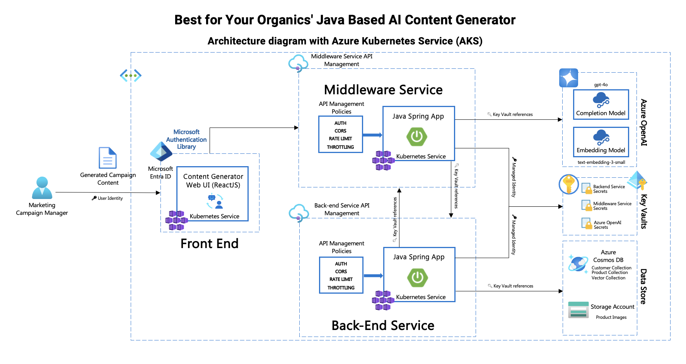

# AI-Based Content Generation Application

## Introduction
This repository contains an AI-based content generation application with three core services:
- **Backend Service**: Exposes customer, product, and product vector APIs (for finding similar products) via backend API Management (APIM).
- **Middleware Service**: Provides content generation and embedding vector APIs, using OpenAI services to process user queries.
- **Frontend Service**: A ReactJS application offering a chat interface where users can submit queries, interact with the system, and receive AI-generated content.

Each service uses Azure Key Vault and Managed Identity for secrets management in production environments. For local development, specific environment variables are required to authenticate against Key Vault.

## Architecture Diagrams
Include the architecture diagrams here:
1. **Azure App Service Architecture**


2. **Azure Kubernetes Service (AKS) Architecture**


## Data Flow Diagram
Illustrates the interaction between frontend, middleware, backend, and external services such as OpenAI and Azure resources.


## Getting Started
### Prerequisites
- Azure account with necessary permissions
- Managed Identity configured for accessing Key Vault secrets
- Azure API Management configured for both backend and middleware services
- Node.js and React for frontend service
- Java Spring Boot for backend and middleware services

### Setup Instructions
1. **Clone the repository**:
    ```bash
    git clone https://github.com/Azure-Samples/Java-AI-Based-Content-Generator
    cd Java-AI-Based-Content-Generator
    ```

2. **Service Setup**:
   - [Backend Setup](./backend/README.md)
   - [Middleware Setup](./middleware/README.md)
   - [Frontend Setup](./frontend/README.md)

## Running Locally
Each service can be run locally with specific instructions provided in each service folder.

**Local Version Architecture**


### Local Environment Variables
To run locally, set the following environment variables to access Azure Key Vault:
```bash
export AZURE_KEYVAULT_URL=<your_keyvault_url>
```
### Key Vault Setup
* [Instructions for Key Vault setup, App Registration, and secret access](key_vault_setup.md)
