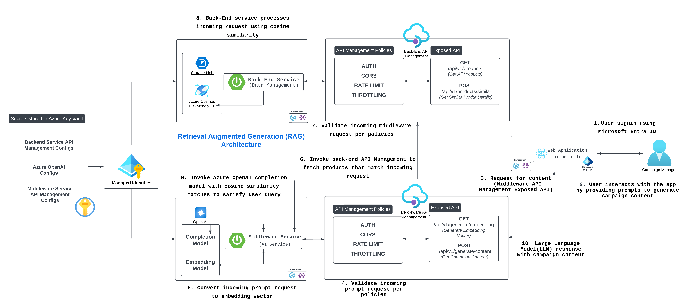

# Content Generator for Marketing Purposes

This repository contains the "Content Generator for Marketing Campaign", a multi-application system designed to generate marketing content based on user selection. The system consists of three separate applications:

1. **Backend**: Handles data management and stores content templates.
2. **Middleware**: Provides AI services for content generation.
3. **Frontend**: A user interface that allows users to generate content by selecting the type (e.g., mail template campaign, social media campaign, article/blog).

## Applications Overview

| Application | Directory                | Purpose                                                                                            |
|-------------|--------------------------|----------------------------------------------------------------------------------------------------|
| Backend     | [backend](backend)       | Manages data, including storing and retrieving content templates.                                  |
| Middleware  | [middleware](middleware) | Interfaces with AI services to generate content based on user input.                               |
| Frontend    | [frontend](./frontend)   | Provides a user-friendly interface for selecting content types and generating marketing materials. |

# Architecture Diagram
## App Service

## Azure Kubernetes Service (AKS)

## Data Flow

## Getting Started

Each application has its own setup instructions and dependencies. Refer to the respective README file in each folder for more details.

### Backend

- Navigate to the [backend README](backend/README.md) for data management setup and instructions.

### Middleware

- Navigate to the [middleware README](middleware/README.md) for AI services setup and instructions.

### Frontend

- Navigate to the [frontend README](frontend/README.md) for UI setup and instructions, allowing users to select content types and generate marketing materials.

## Price Estimation
- [App Service](https://azure.com/e/9ace011a0f4241db809253649e076541)
- [AKS](https://azure.com/e/7db212126c93457c9a35fea2b711166f)
