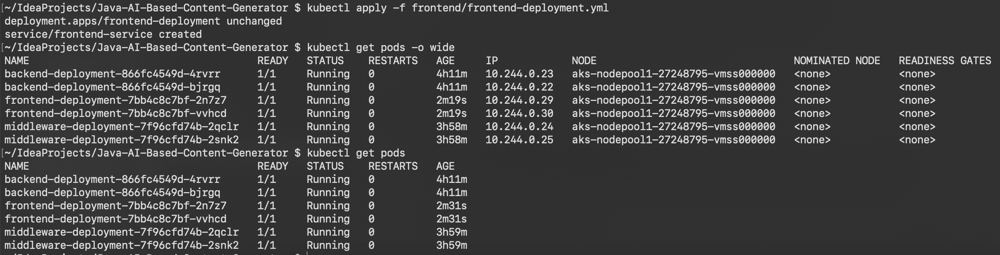

# Deploying The Application to Azure Kubernetes Service (AKS)
This guide covers the steps to build, push, and deploy a Java and ReactJS application to Azure Kubernetes Service (AKS) using the CLI.

## Prerequisites

* Azure CLI installed and logged in
* Azure Kubernetes Service (AKS) and Azure Container Registry (ACR) set up
* Maven installed
* kubectl installed
* NodeJS installed
* Docker installed


## Step 1: Set Up AKS and ACR
If you don't already have an Azure Kubernetes Service (AKS) and Azure Container Registry (ACR) set up, you can follow this optional step to create them.

### Create AKS Cluster and ACR

To create an AKS cluster and ACR, use the following commands:

1. **Create a resource group:**
   ```bash
   az group create --name <YOUR_RESOURCE_GROUP> --location <LOCATION>
   ```

2. **Create an ACR:**
   ```bash
   az acr create --resource-group <YOUR_RESOURCE_GROUP> --name <YOUR_ACR_NAME> --sku Basic
   ```

3. **Create an AKS cluster:**
   ```bash
   az aks create \
    --resource-group <YOUR_RESOURCE_GROUP> \
    --name <YOUR_AKS_CLUSTER_NAME> \
    --attach-acr <YOUR_ACR_NAME> \
    --enable-managed-identity \
    --enable-oidc-issuer \
    --enable-workload-identity \
    --generate-ssh-keys
   ```
Once the AKS cluster and ACR are set up, proceed with the next steps.

## Step 2: Build and Push Docker Image

### Build Docker Image
To build the Docker image, use the following command:

```bash
# ACR Login
az acr login --name <ACR_NAME>

# Build docker image
docker build -t <ACR_Name>.azurecr.io/aistudy/<SERVICE_NAME>:latest .

```


### Push Docker Image
Push the Docker image to your ACR:

```bash
docker push <ACR_Name>.azurecr.io/<SERVICE_NAME>:latest
```

## Step 3: Run Docker Image Locally (Optional)
If you want to test the Docker image locally, use the following commands:

### Build Docker Image Locally
```bash
docker build -t <ACR_Name>.azurecr.io/aistudy/<SERVICE_NAME>:latest .
```
### Run Docker Image Locally
```bash
# Java Spring Boot Application
docker run -p 8080:8080 <ACR_Name>.azurecr.io/aistudy/<SERVICE_NAME>:latest

# ReactJS Application
docker run -p 3000:80 <ACR_Name>.azurecr.io/aistudy/<SERVICE_NAME>:latest
```
You can access the application at **http://localhost:8080** and **http://localhost:3000**.

## Step 5: Deploy to AKS

### Update Variables in `deployment.yml`

Before run the Docker image in K8S, make sure that the environment variables in your `SERVICE-deployment.yml` are up to date. These variables are critical for your application to interact with Azure services like ACR, and App Client ID.

### Apply Kubernetes Deployment Locally
First, apply the Kubernetes deployment using the following command:

```bash
kubectl apply -f <SERVICE>-deployment.yml
```
### Push Kubernetes Deployment to AKS
To deploy the application to AKS, ensure your kubectl is connected to your AKS cluster, then apply the deployment:

1. **Log in to Azure**
   Log in to your Azure account using the Azure CLI:
    ```bash
   az login
    ```
2. **AKS Login**
   ```bash
    az aks get-credentials --resource-group <RESOURCE_GROUP_NAME> --name <AKS_NAME>
   ```
## Deploy to AKS
```bash
kubectl apply -f <SERVICE>-deployment.yml
```
This will deploy your application to the AKS cluster.
## Check the Status of Deployments

To check the status of the deployments, use the following command:

```bash
kubectl get deployments
kubectl get services 
kubectl get pods
```
This will show you the status of the deployments and services in your AKS cluster.




## Step 4: Destroy Resources (Optional)

If you want to clean up and destroy the resources after you're done, you can follow these steps:

**Delete Resource Group**
To delete the resource group, which will also delete all associated resources, use the following command:
   ```bash 
   az group delete --name <YOUR_RESOURCE_GROUP> --yes --no-wait
   ```
This will completely remove your AKS cluster, ACR, and all resources associated with the resource group.
With these additional instructions, users will have the option to destroy all resources created for the deployment, ensuring a clean environment if needed.
