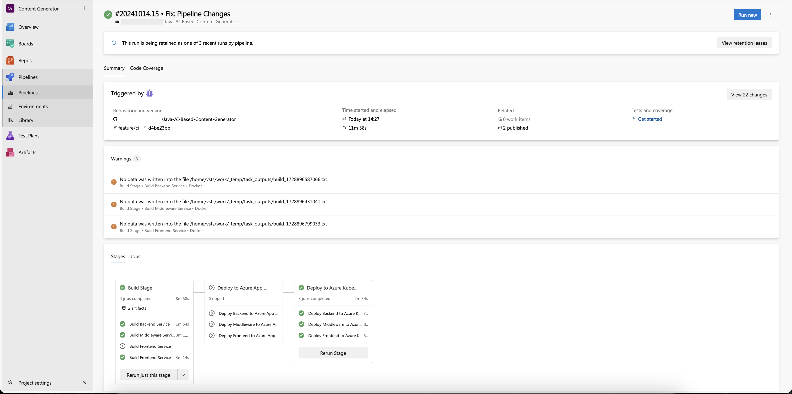
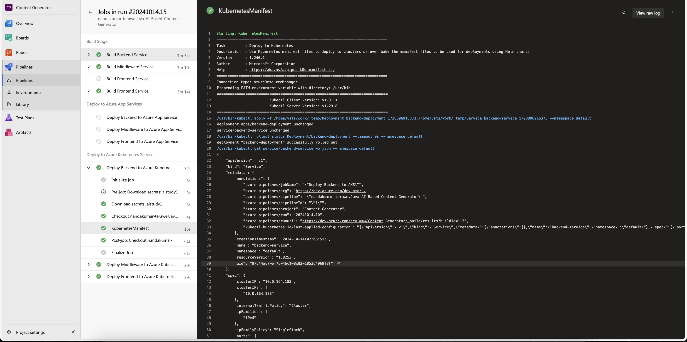

# Azure DevOps CI/CD Pipeline for Azure App Service and AKS Deployment

This document provides a setup reference for configuring CI/CD pipelines using Azure DevOps for a **Java Spring Boot backend**, **Java Spring Boot middleware**, and a **ReactJS frontend**. The pipeline will build and deploy these applications to **Azure App Service** and **Azure Kubernetes Service (AKS)**.

The YAML file [(`azure-pipelines.yml`)](azure-pipelines.yml) located at the root of the repository contains the pipeline configuration and is structured as follows:

## Pipeline Overview

The pipeline includes:

1. **Build Stage**: Builds each application (`backend`, `middleware`, and `frontend`) in parallel, producing artifacts for deployment.
2. **Deploy Stage**: Deploys the artifacts to Azure App Service and AKS using service connections.

## Pipeline Configuration Explanation

### Variable Groups

In the pipeline, we utilize variable groups to manage environment-specific values and secrets:


```yaml
variables:
  - group: ai-study-vg
  - group: ai-study-secrets
```
* `ai-study-vg`: Contains environment variables such as Azure Subscription ID, Resource Group, and Application Names.

* `ai-study-secrets`: Retrieves secrets from Azure Key Vault, such as API keys and service base URLs, ensuring sensitive information is not hard-coded in the pipeline.


**Variable Groups**

We will utilize variable groups to manage our configurations efficiently. In particular, we will set the `DeploymentTarget` variable in the variable group `ai-study-vg` to determine whether we are deploying to AKS or App Service.

* **Adding Variables** 

  * `DeploymentTarget`: This variable will dictate the target deployment, allowing us to switch between AKS and App Service as needed.
    

### Configuring Service Connection for Azure Container Registry (ACR)

Before deploying your applications to Azure Kubernetes Service (AKS), it's essential to set up a service connection for Azure Container Registry (ACR). This allows Azure DevOps to authenticate and pull images from your ACR. Follow these steps to configure the service connection:

#### Step 1: Access Your Azure Container Registry

  * Navigate to Azure Portal and find your Azure Container Registry resource.
  * In the left-hand menu, select Access keys.

#### Step 2: Copy the Required Values

In the Access keys section, you will find two important values:

  * Login Server: This will typically be in the format `youracrname.azurecr.io`.
  * Admin User Password: This is used for authentication.


#### Step 3: Create the Service Connection

1. In your Azure DevOps project, navigate to **Project Settings** > **Service connections**.
2. Click on New service connection and select **Docker Registry**.
3. Choose **Others** as the Docker Registry type.
4. Enter the following details:
   * **Registry**: $(`DockerRegistry`) (the variable you created in `ai-study-vg`)
   * **Username**: Your ACR username (usually the name of your ACR)
   * **Password**: Use the **Admin User Password** you copied earlier.
5. Name your service connection (e.g., `AI Study Container`) and save it.


#### Step 4: Store the Values in Variable Group

1. Go to your Azure DevOps project.
2. Select **Pipelines** > **Library**.
3. Find the variable group `ai-study-vg`.
4. Add a new variable named `DockerRegistry` and service connection name (e.g., `AI Study Container`).


Now your Azure DevOps pipeline can authenticate to ACR and pull the necessary images for your AKS deployments.


### Build Stage
Each of the services (`backend`, `middleware`, and `frontend`) is built in parallel:

```yaml
jobs:
  - job: Build_Backend
    displayName: 'Build Backend Service'
    steps:
      - task: Maven@4
        inputs:
          mavenPomFile: 'backend/pom.xml'
          goals: 'clean package'

```
* The `Maven@4` task compiles and packages the Java application from the `backend/pom.xml` file.
* Artifacts are published for later use in the deployment stage.

### Deploy Stage
The deployment stage consists of jobs for each application, deploying to either Azure App Service or AKS:

```yaml
jobs:
  - job: Deploy_Backend_AppService
    displayName: 'Deploy Backend to Azure App Service'
    steps:
      - task: AzureWebApp@1
        inputs:
          azureSubscription: '$(AzureSubscription)'
          appName: '$(BackendAppServiceName)'
          package: '$(Pipeline.Workspace)/backend/backend.war'
```

* The `AzureWebApp@1` task is used to deploy the `backend.war` artifact to the specified Azure App Service.
* Variables such as `$(AzureSubscription)` and `$(BackendAppServiceName)` are retrieved from the variable groups defined earlier.

### Explanation of the AzureWebApp@1 Task
The `AzureWebApp@1` task in Azure DevOps is used to deploy applications to Azure App Service. It requires the following inputs:

`azureSubscription`: The service connection name to authenticate against Azure.
`appName`: The name of the Azure Web App to which the package will be deployed.
`package`: The path to the artifact (e.g., `backend.war`) that will be deployed.
`appType`: The type of Azure App Service (e.g., `webAppLinux`).

### Reference for Azure Service Connection
For this pipeline to work, you must have a service connection established between Azure DevOps and Azure. You can follow the [Azure Service Connection](https://learn.microsoft.com/en-us/azure/devops/pipelines/library/service-endpoints?view=azure-devops) documentation to set up this connection.

### Deploying to Azure Kubernetes Service (AKS)
For AKS deployments, Docker images are built from the application code and pushed to Azure Container Registry (ACR). The Kubernetes manifests (`*-deployment.yml`) are applied using `kubectl` commands.

```yaml
jobs:
  - job: Deploy_Backend_AKS
    displayName: 'Deploy Backend to AKS'
    steps:
      - task: KubernetesManifest@1
        inputs:
          action: 'deploy'
          connectionType: 'azureResourceManager'
          azureSubscriptionConnection: '$(AzureSubscription)'
          azureResourceGroup: '$(ResourceGroupName)'
          kubernetesCluster: '$(AKS)'
          manifests: 'backend/backend-deployment.yml'

```

### GitHub Repository Integration
To integrate a GitHub repository in Azure DevOps, navigate to **Project Settings > Repos > GitHub Connections** and add your GitHub repository. This allows you to trigger the pipeline automatically on code changes.

 


### Testing the Pipeline
After configuring the pipeline, run it manually or trigger it by committing code changes to your GitHub repository. Check the pipeline logs for build and deployment success, and validate the application is live in Azure App Service or AKS.






### Conclusion
By following this setup, you now have a production-grade CI/CD pipeline that automates the build and deployment process for multiple services to Azure App Service and AKS. This setup ensures consistency and reduces manual intervention, streamlining the development workflow.