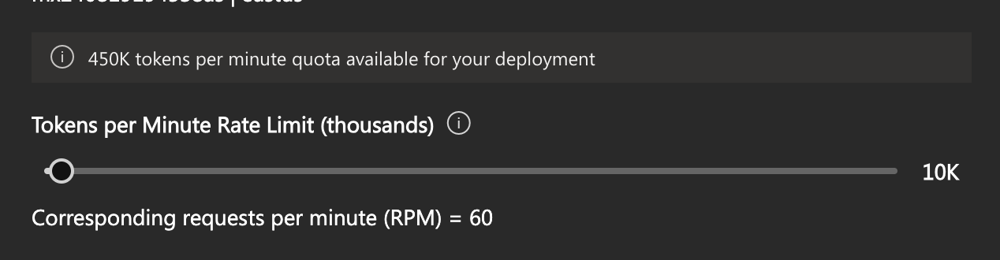
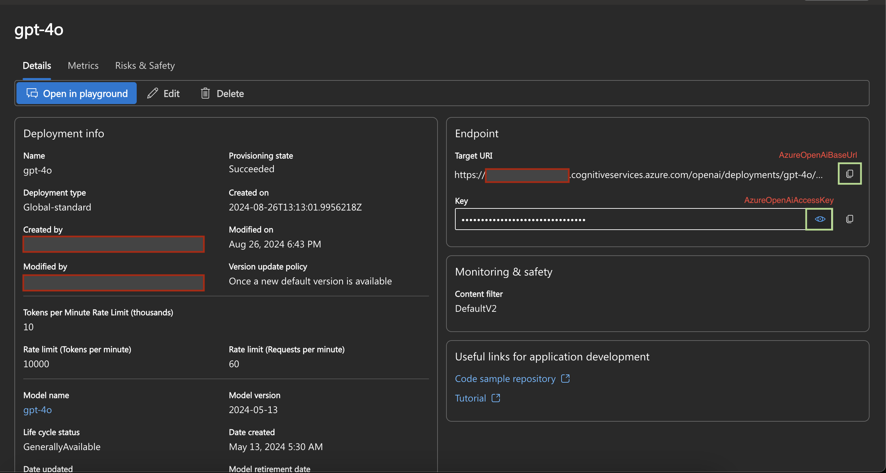

# Marketing Content Generator Backend API

This is a backend API for generating marketing content, built using Spring Boot and integrated with Azure OpenAI.

## Features

- Generate marketing content using Azure OpenAI GPT models.
- Backend API for content generation, customizable for different marketing needs.

## Prerequisites

- Java 17
- Maven
- Azure account with OpenAI deployed
- Azure OpenAI API Key and Endpoint

## Getting Started

## 1. **Clone the Repository**

   ```bash
   git clone https://github.com/terawe/contentgenerator.git
   cd middleware
   ```
   
   ## Setup Environment Variables - [Reference](env_variables.md)

## 2. **Configure Azure OpenAI** - [Reference](https://learn.microsoft.com/en-us/azure/ai-studio/)

## Chat Completion
* Go to [Azure OpenAI](https://ai.azure.com) and deploy the GPT model.
* Retrieve your **Azure OpenAI Endpoint URI** and **Azure OpenAI API Key** from your deployment details and add it in the key vault.
* **Tokens per Minute Rate Limit:** Ensure you are aware of the rate limits for tokens per minute as specified in your Azure OpenAI service plan. This limit is measured in thousands of tokens per minute and helps in managing usage and avoiding overage charges.



## Generate Embedding
* Go to [Azure OpenAI](https://ai.azure.com) and deploy the text embedding model.
* Retrieve your **Azure OpenAI Endpoint URI** and **Azure OpenAI API Key** from your deployment details and add it in the key vault.
* **Tokens per Minute Rate Limit:** Ensure you are aware of the rate limits for tokens per minute as specified in your Azure OpenAI service plan. This limit is measured in thousands of tokens per minute and helps in managing usage and avoiding overage charges.

## 3. **Azure Key Vault Setup and App Registration**
   * Create Azure Key Vault and Set Secrets 
     * **Step 1: Create an Azure Key Vault**
       * Go to the Azure Portal. 
       * Navigate to "Create a resource" and search for "Key Vault". 
       * Click "Create" and fill in the required details:
          ```
           Name: Your Key Vault name (e.g., myKeyVault)
           Subscription: Choose your subscription
           Resource Group: Create or select an existing resource group
           Region: Choose the region where you want to deploy the Key Vault
          ``` 
       * Click "Review + create" and then "Create".
     * **Step 2: Set Secrets in Azure Key Vault**
       * Navigate to your Key Vault in the Azure Portal.
       * Go to the "Secrets" section and click "Generate/Import". 
       * Enter the name and value for each secret. Use the constants listed below for reference:
            ```
               BackendServiceBaseUrl
               BackendServiceProductEndpoint
               BackendServiceSimilarProductEndpoint
               BackendServiceAccessKey
               AzureOpenAiEndpointUrl
               AzureOpenAiAccessKey
               AzureOpenAiEmbeddingEndpointUrl
               AzureOpenAiEmbeddingKey
            ```
       * Click "Create" to add each secret.

## 4. **Update Application Properties**
   
   Open the `application.properties` file ( path [src/main/resources/application.properties](src/main/resources/application.properties)) and update the following values:

## 5. **Azure Managed Identity Setup** - [Reference](env_variables.md)

## 6. **Run the Application**

   Use Maven to run the application:
    
```bash
./mvnw spring-boot:run
```

## 7. **Build the Application**

   Use Maven to run the application:
```bash
./mvnw clean package
```

## Deployment Methods

### 1. Deploying to Azure Kubernetes Service (AKS)

You can deploy the application to an Azure Kubernetes Service (AKS) cluster. Detailed instructions are provided in the [AKS Deployment Guide](aks.md).

- **API Exposure**: Once deployed, the API should be exposed via Azure API Management. For more information, refer to the [API Management Guide](api_management.md).

### 2. Deploying to Azure App Service

Alternatively, you can deploy the application to Azure App Service. Follow the steps outlined in the [App Service Deployment Guide](app_service.md).

- **API Exposure**: Similar to the AKS deployment, the API for the App Service deployment should be exposed via Azure API Management. Details can be found in the [API Management Guide](api_management.md).

## API Management

Azure API Management provides a unified front-end for your application’s APIs. Regardless of whether you deploy to AKS or App Service, using Azure API Management allows you to:

- Securely expose your APIs
- Monitor and analyze API usage
- Apply policies for rate limiting, authorization, etc.

More details can be found in the [API Management Guide](../api_management.md).